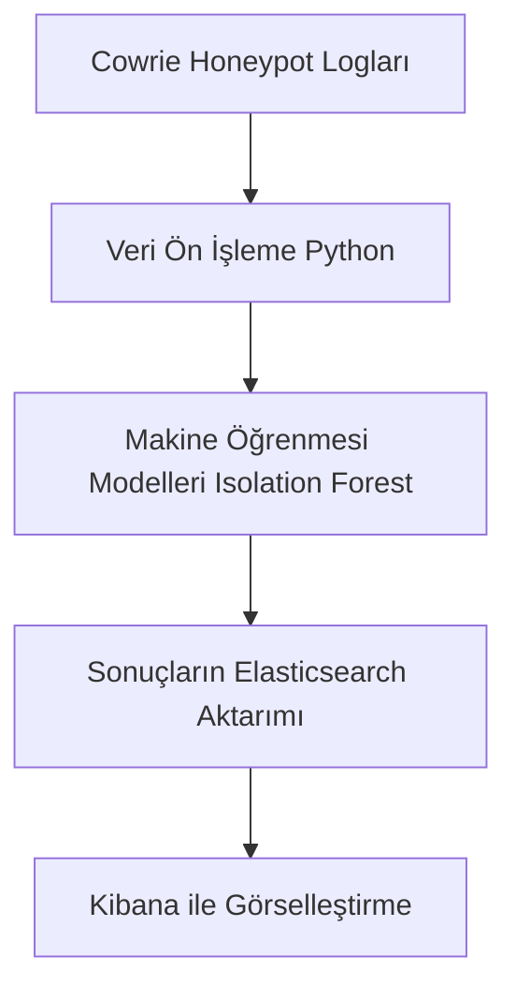

# CowrieMLProje

## Proje Hakkında

CowrieMLProje, Cowrie honeypot tarafından toplanan siber saldırı loglarının makine öğrenmesi teknikleri kullanılarak analiz edilmesini ve anomali tespitinin otomatikleştirilmesini amaçlayan kapsamlı bir projedir. Projede, saldırı verileri ELK (Elasticsearch, Logstash, Kibana) stack ile görselleştirilirken, Python tabanlı makine öğrenmesi modelleri kullanılarak anormal davranışlar tespit edilmektedir.

Bu sayede siber güvenlik analistleri, büyük veri setleri içerisinden anlamlı sonuçlar çıkarabilir ve saldırılara hızlı müdahale edebilir.

---

## Özellikler

- **Cowrie Loglarının Toplanması:** Cowrie honeypot tarafından oluşturulan JSON formatındaki log dosyalarının otomatik olarak işlenmesi.  
- **Veri Ön İşleme:** Log verilerinden gereksiz bilgiler temizlenir, uygun formatlara dönüştürülür.  
- **Makine Öğrenmesi ile Anomali Tespiti:** Isolation Forest, K-Means gibi modellerle saldırıların normal davranışlardan ayrıştırılması.  
- **ELK Stack Entegrasyonu:** Analiz sonuçlarının Elasticsearch’e aktarılması ve Kibana ile detaylı görselleştirme yapılması.  
- **Kullanıcı Dostu:** Kolay kurulum ve kullanım için Python sanal ortamı ve requirements dosyasıyla desteklenmiş.  
- **Genişletilebilir:** Yeni modeller ve görselleştirme teknikleri eklemeye uygundur.

---

## Teknolojiler

| Teknoloji       | Açıklama                           |
|-----------------|----------------------------------|
| Python 3.8+     | Veri işleme ve makine öğrenmesi  |
| scikit-learn    | Makine öğrenmesi modelleri       |
| pandas, numpy   | Veri manipülasyonu               |
| Elasticsearch   | Veri depolama ve arama motoru   |
| Logstash        | Veri toplama ve işlem hattı      |
| Kibana          | Veri görselleştirme              |
| Cowrie Honeypot | Saldırı loglarının kaynağı       |

---

## Sistem Gereksinimleri

- Python 3.8 veya üzeri  
- Git  
- Cowrie honeypot kurulu ve log dosyalarının erişilebilir olması  
- ELK Stack kurulumu (Elasticsearch, Logstash, Kibana)  
- İnternet bağlantısı (kütüphane kurulumları için)  

---

## Kurulum ve Başlangıç

1. **Projeyi Klonla veya İndir**  
```bash
git clone https://github.com/kullaniciadi/CowrieMLProje.git
cd CowrieMLProje
```
2. **Sanal Ortam Oluştur ve Aktif Et**  
```bash
python3 -m venv mlenv
source mlenv/bin/activate      # Linux/macOS
mlenv\Scripts\activate         # Windows
```
3. **Gerekli Kütüphaneleri Yükle**
```
pip install -r requirements.txt
```
4. **Cowrie Log Dosyasını Yerleştir**
Log dosyası /home/cowrie/cowrie/var/log/cowrie/cowrie.json veya config dosyasında belirtilen yolda olmalıdır.

5. **Analizi Başlat**
```
python analyze.py
python data_preprocessing.py
python encoding.py
python feature_engineering.py
python anomaly_detection.py
python save_anomalies.py
python visualization.py
```

## Proje Mimari Şeması

İletişim

Herhangi bir soru veya öneri için:
Öznur Siram
GitHub: https://github.com/oznursm
LinkedIn: https://www.linkedin.com/oznursm
